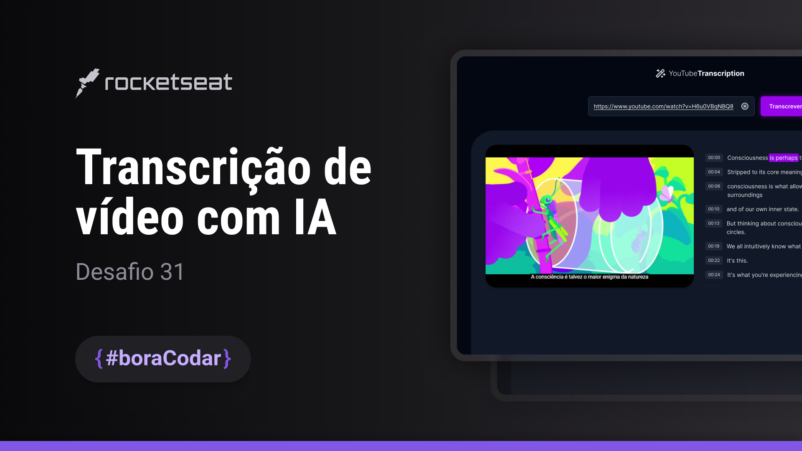

<h1 align="center">Transcrição de vídeo com IA</h1>

<p align="center">Desafio #boraCodar 31 da Rocketseat</p>

<p align="center">
    <a href="https://lucasregisdemoraes.github.io/boracodar">Acesse todos os desafios #BoraCodar concluidos por mim aqui</a>
</p>

<br>

<p align="center">
    
</p>

## Como executar esse projeto

1. Faça o clone desse repositório
2. Acesse a pasta do projeto
3. Instale o projeto com o comando `npm install`
4. Em um terminal, utilize um dos comandos 
```bash
npm run dev
# or
yarn dev
# or
pnpm dev
```
5. Em outro terminal, utilize o comando `npm run server`, para iniciar servidor
6. No seu navegador abra `http://localhost:5173` ou o local sugerido no terminal para ver o resultado


## Tecnologias

Esse projeto foi desenvolvido com as seguintes tecnologias:

- [Phosphor Icons](https://phosphoricons.com/)
- [ViteJS](https://vitejs.dev/)
- [YouTube Iframe API](https://developers.google.com/youtube/iframe_api_reference#Getting_Started)
- Express
- Cors
- axios
- [nytdl-core](https://github.com/fent/node-ytdl-core)
- [ffmpeg-static & fluent-ffmpeg](https://creatomate.com/blog/how-to-use-ffmpeg-in-nodejs)
- [transformers.JS](https://github.com/xenova/transformers.js)

## Layout
- [Layout design from](https://www.fronteditor.dev/gists/64e6ade5434ccd23e6ad89d50cafea3b/view)